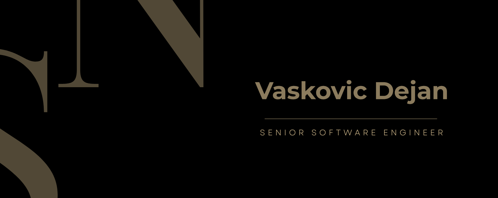

<h1 align="center">
  
    Vaskovic Dejan
  
</h1>

<h3 align="center">Welcome to my Profile!</h3>

  As a dedicated Full Stack Engineer, I bring a wealth of expertise in both frontend and backend development to the table.  
  With a solid foundation in Python and a keen eye for detail, I thrive on crafting innovative solutions that seamlessly integrate user interfaces with robust server-side logic. 
  My passion for development is unwavering and drives me to continually pursue new technologies to push boundaries and improve my skills.  
  Committed to delivering excellence, I approach every project with enthusiasm and a relentless pursuit of perfection.

